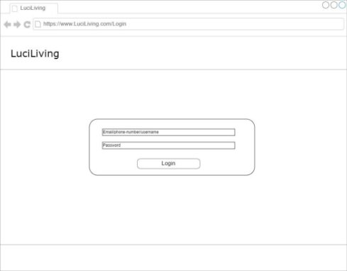

13730  T3A2-A  Joshua Nahlous 

T3A2-A – Full Stack Application (Part A) 

 [https://github.com/Hmmmm-Josh/T3A2-A/tree/main](https://github.com/Hmmmm-Josh/T3A2-A/tree/main)

*R1 – Description of my Website* 

- Purpose When passing on, you’re going to need a home, so being buried with your money and prized possession will give you a leg up in Hell. What? You thought you were going to Heaven? No one’s that perfect. Everyone ends up here… That’s why at LuciLiving we’re able to find you a home in the depths of Hell – Make Hell your Home.  
- Target Audience 
  - We Try  to  make  the market  available to everyone:  Overlords,  Sinners, Imps,  and  even the Dammed and Blood Bound Sinners. This is available to anyone who wants to rent, buy, sell or rent a home. Either as a private individual or as a real estate company. 
- Functionality / Features 

With LuciLiving you’ll be able to: 

- Create a profile 
  - Create a profile as a Buyer, Seller, Renter or Real-Estate Agent, Landlord 
- Search and buy/sell/rent homes 
  - Search with filters to narrow down the search.  
- Search for Real-estate agents. 
- Save properties to your profile to view at a different time and come back to for notifications. 
- Nice to have: Map locations with interactive locations 
- Tech Stack 
- MongoDB 
- Express 
- React 
- React Bootstrap for styling 
- Node.js 

*R2 – Dataflow Diagram* 

*R3 – Application Architecture Diagram* 

For the architecture diagram I have come up with a simple design to show the relationships between the database, front-end and back-end. 

*R4 – User Stories* **Buyers** 

From a simple buyer’s perspective, they are able to search homes they wish to buy based on range of filters: Location, Max/min price and property type. From this case they should be able to save pages linked to their profile so that they can come back to them at any time. and track and monitor the pages/prices with notifications turned on. You should also be able to search for the real-estate agent and find their details in order to message them (their profiles would be public for people to lookup). 

**Renters** 

For a simple renter’s perspective, they would be able to search for homes to be able to rent and filter what they are trying to rent. They should also be able to view the Landlord and real-estate agents’ profile so that they could see who they are renting from and see if it would be a good decision. They should be able to do a lot of features like a simple homebuyer should, but for renting instead. 

**Sellers** 

For a simple Seller, they are someone that is wanting to upload their home to the website to sell. They would need to be able to upload their home/s and add details towards it to be uploaded into the property database. They should be able to contact real-estate agents to either add their listing in a joint way to an agent’s profile to be seen more.  

**Real-estate agents (Serial Sellers)** 

For a real-estate agent they would be someone that is a “Serial Seller” having multiple properties to sell for people. And would be able to display their own details all over their profile so that they get into contact with people easily. The real-estate agent would be someone dedicated to either selling or helping with listing a rental, and would have multiple properties, and possibly a history of properties they have sold on their profile. 

**Landlords (Serial Buyers)** 

From a landlord’s perspective, they would be someone that is wanting to buy multiple homes, rent out those homes and be able to list all of their details on their profile too. Like a real-estate agent, they would be able to properties that they have and what prices they are renting them out for, and even possibly able to have reviews from tenants (to keep them in check). They could possibly work with real- estate agents to find tenants wanting to rent too 

*R5 – Wireframes for multiple standard screen sizes, created using industry standard software* 

Above is the wireframe for the Homepage, and below is the wireframe for signing up when clicking though 

Above is the Login screen where they are can sign in via the home page. And below is how you can edit your profile after you have logged in. 

Below is a wireframe for the buying page. It shows a simple design with filters on searching homes to buy, and it also has links to other pages other various buying needs 

Above is a simple layout for a home that is for sale, with filler just in place to layout the area for how I would create a standardised page for each home for sale in the Properties Database. 

Below is the same design for buying, but instead it is used for renting houses, and is in a mobile phone layout. And next to it is a display of the same home in phone format. 

` `

And below is a smaller/phone sized wireframe for the homepage.  

*R6 – Screenshots of your Trello board throughout the duration of the project [https://trello.com/b/QvnY5NN1/luciliving ](https://trello.com/b/QvnY5NN1/luciliving)*

I was making this project by myself, So I only needed a Trello Board. 

**References** 

- Amazon Web Services. (2024). What is architecture diagramming? Amazon Web Services, Inc. [https://aws.amazon.com/what-is/architecture-diagramming/ ](https://aws.amazon.com/what-is/architecture-diagramming/)
11 
